# Image-to-World

단일 이미지를 입력으로 받아 객체 단위로 장면을 분해하고, 각 객체의 3D 자산과 깊이 정보를 추정한 뒤 하나의 scene으로 다시 조합하는 modular reconstruction pipeline입니다.

## 프로젝트 개요

### 문제 정의

단일 이미지에서 바로 완성된 3D indoor scene을 복원하는 것은 여전히 어렵습니다. 특히 다음 문제가 한 번에 얽혀 있습니다.

- 어떤 객체가 장면 안에 있는지 식별해야 함
- 객체별 마스크와 가려진 영역을 분리해야 함
- 객체의 대략적인 3D 형상을 복원해야 함
- 상대적 depth를 바탕으로 장면 안의 배치를 추정해야 함
- 최종적으로 하나의 scene mesh로 조합해야 함

이 프로젝트는 이 문제를 여러 단계로 나누어 풀고 있습니다.

## 개발 환경

- 언어: Python 3.11
- 실행 환경: PyTorch 기반 (`cuda`/`cpu` 선택 가능, GPU 사용 권장)
- 권장 환경 관리: 프로젝트 로컬 가상환경(`.venv`)
- 외부 의존 리포지토리: `Grounded-SAM-2`, `shap-e`, `external/PerspectiveFields`
- 필수 가중치/체크포인트:
  - `Grounded-SAM-2/checkpoints/sam2.1_hiera_large.pt`
  - `external/PerspectiveFields/models/paramnet_360cities_edina_rpfpp.pth`

## 실행 방법

### 1. 입력 이미지 준비

입력 이미지를 아래 경로에 둡니다.

```bash
artifacts/raw_image.jpg
```

기본 설정은 [image_to_world/config.py](image_to_world/config.py)에 모여 있습니다. 입력 경로, 모델 ID, threshold, depth/layout heuristic은 이 파일에서 조정합니다.

### 2. 전체 파이프라인 실행

전체 pipeline을 처음부터 끝까지 실행합니다.

```bash
python run_pipeline.py
```

특정 device를 지정하려면:

```bash
python run_pipeline.py --device cuda
python run_pipeline.py --device cpu
```

이미 생성된 결과를 재사용하면서 없는 stage만 실행하려면:

```bash
python run_pipeline.py --skip-existing
```

기존 결과를 덮어쓰며 다시 생성하려면:

```bash
python run_pipeline.py --overwrite
```

### 3. 특정 구간만 실행

예를 들어 mask 이후부터 assembly까지 다시 돌리고 싶다면:

```bash
python run_pipeline.py --from generate_masks --to assemble_scene
```

depth 이후만 다시 보고 싶다면:

```bash
python run_pipeline.py --from estimate_depth --to assemble_scene
```

### 4. 개별 stage 실행

현재는 루트의 `01_tag.py` 같은 래퍼 파일 대신, stage 모듈을 직접 실행하는 구조입니다.

```bash
python -m image_to_world.stages.extract_tags
python -m image_to_world.stages.generate_masks
python -m image_to_world.stages.complete_objects
python -m image_to_world.stages.generate_meshes
python -m image_to_world.stages.estimate_depth
python -m image_to_world.stages.compose_layout
python -m image_to_world.stages.assemble_scene
```

각 stage도 동일하게 다음 옵션을 지원합니다.

```bash
--device cuda|cpu
--skip-existing
--overwrite
```

## 구현 현황

- [x] 객체별 마스크 추출
- [x] 객체별 3D mesh 생성
- [x] 객체별 transform 계산
- [x] 단일 OBJ/MTL로 scene assembly

- [x] depth 결과 point cloud 시각화 추가
- [x] 카메라 추정 stage 추가 및 파이프라인 연결 
- [x] 카메라/깊이/레이아웃/어셈블리 시각화 흐름 연동
- [x] depth 모델 전환: relative -> absolute
- [x] 객체 배치 로직 개선

- [ ] 텍스처 지원 가능한 3D 생성 모델 검토
- [ ] 3D mesh의 noise와 과도한 geometry를 줄이는 후처리 추가
- [ ] inpaint 및 mesh 생성 단계 속도 개선 (모델 교체 또는 수치 조정) 

- [ ] 카메라 왜곡 보정 후 월드좌표계 변환 시각화
- [ ] 객체 마스크 필터링 규칙 (기존 태그 직접 필터링 방식 제거)
- [ ] 객체 위치,회전,크기 계산 규칙 다시 생각해야함 (depth mask만을 이용한 방식의 한계)

- [ ] 배경/구조물 복원
- [ ] 배치 이상치 정밀 보정 (공중에 뜨거나 서로 겹치는 등의 현상)
- [ ] 입력 이미지와 비교하여 객체 배치 정밀 보정

- [ ] 외부 라이브러리 의존성 관리 (git clone, pip install git 혼용 중)
- [ ] 체크포인트 경로 정리
- [ ] 산출물 경로 정리
- [ ] image-to-world 폴더 이름 `src` 로 변경

- [ ] OBJ export 축 정합 이슈 정리 (현재 X-mirror 임시 호환 처리 제거 방향 확정)
- [ ] 카메라 추정 실패 케이스 예외 처리 및 로그 보강
- [ ] `compose_layout` -> `assemble_scene` 경계 데이터 규칙 정리 (`primitive`/`mesh` fallback)
- [ ] 시각화 산출물(camera/depth/layout/assembly) 포맷/저장 규칙 문서화

## 결과물

> `2026-04-10` : 객체 배치 정확도 개선

### Test 01 (기존 이미지)

#### Depth estimation

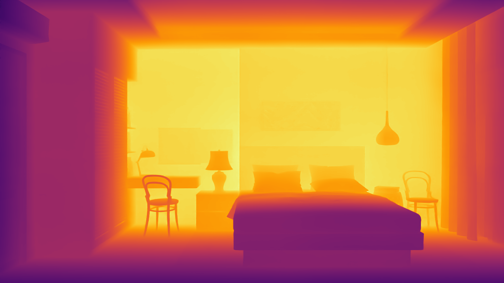
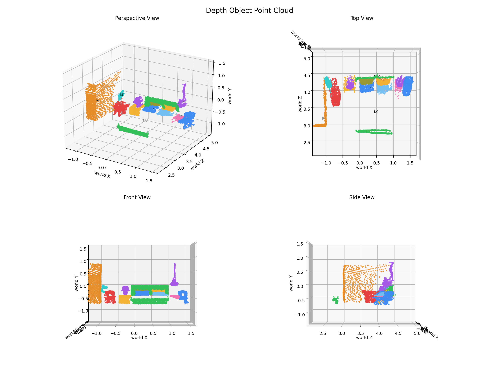

#### Camera calibration

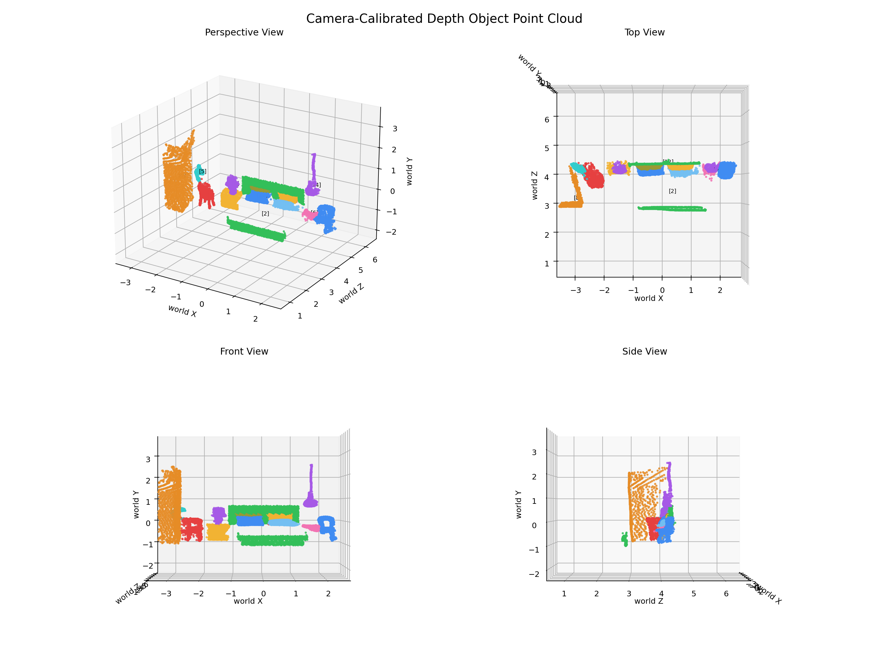

#### Layout preview

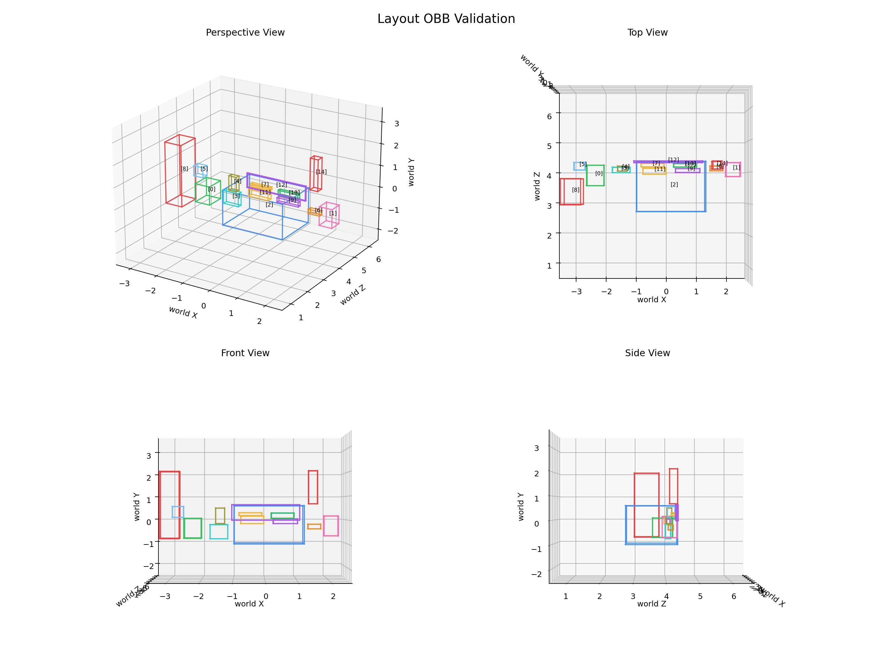

#### Output

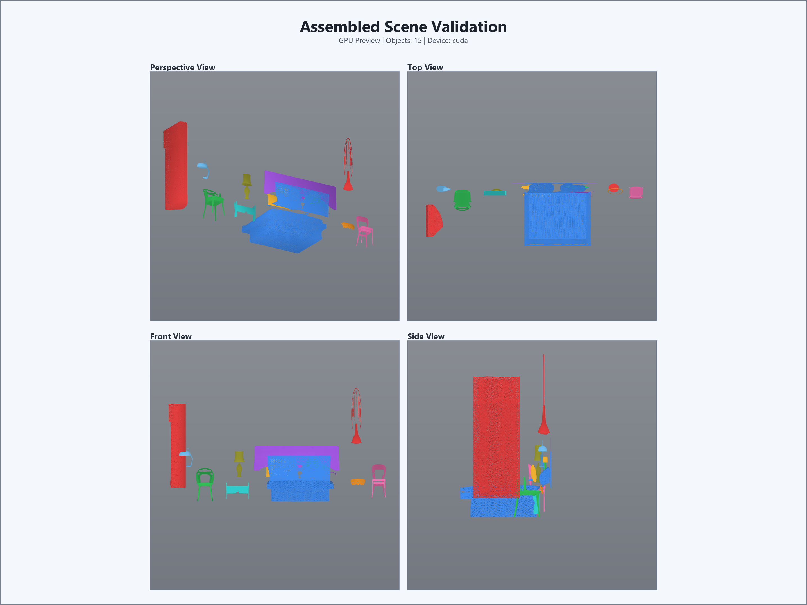
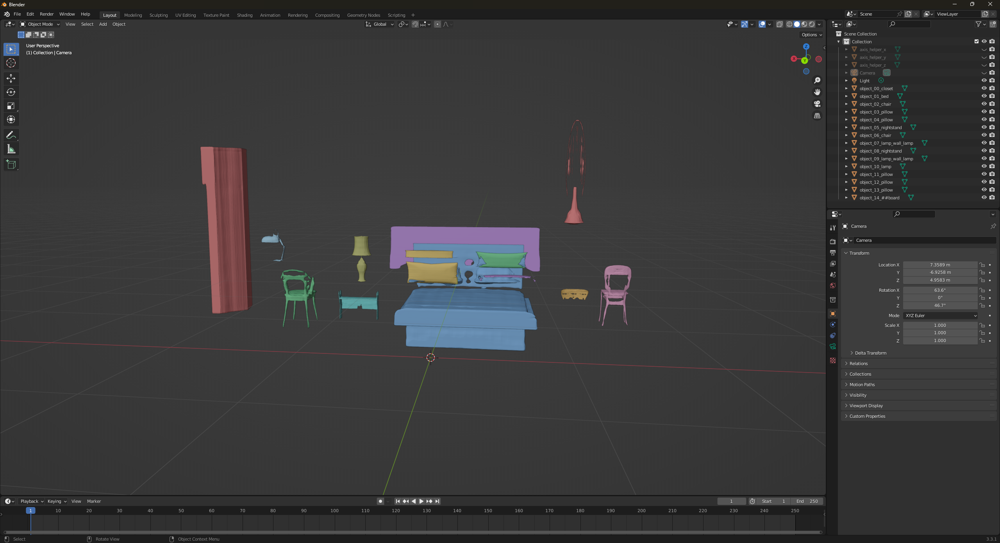

### Notes

- absolute depth와 카메라 추정을 연결하면서 객체 배치 정합도가 이전 대비 개선되었다.
- 카메라 왜곡 보정 전후 모두 약간씩 오차가 있다.
- OBJ export 축은 임시 호환 처리이므로 정리가 필요하다.

### Test 02 (단순한 이미지)

#### Input image

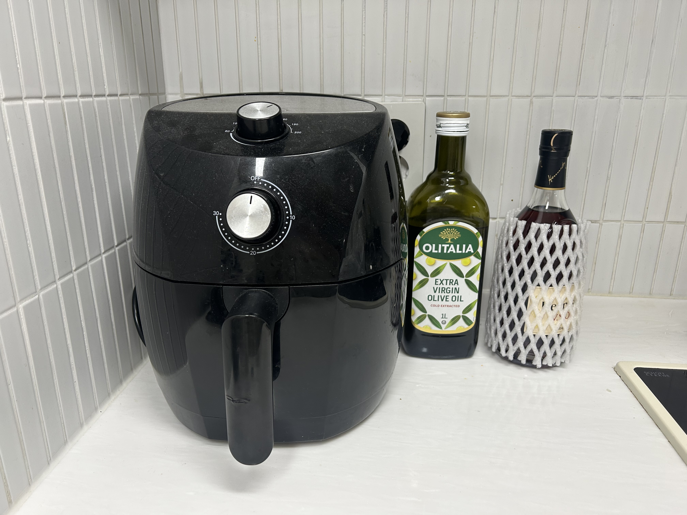

#### Object segmentation


#### Depth estimation

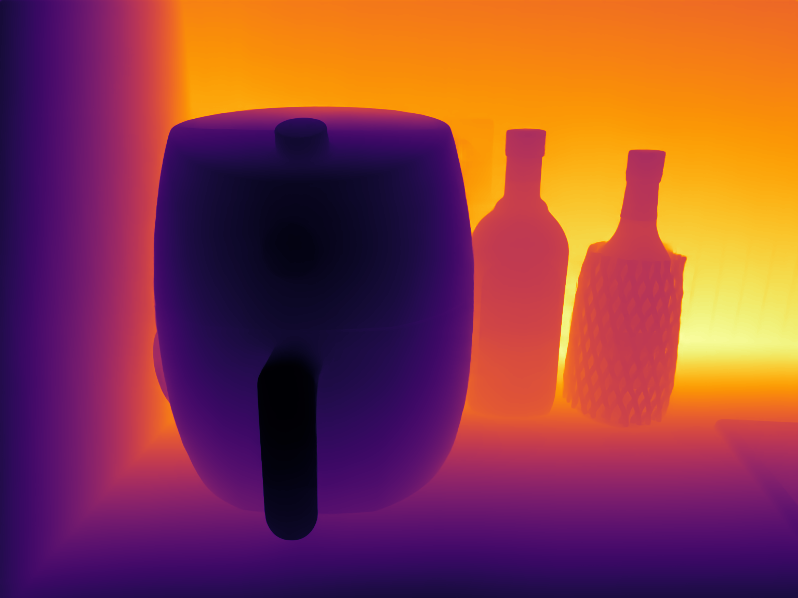
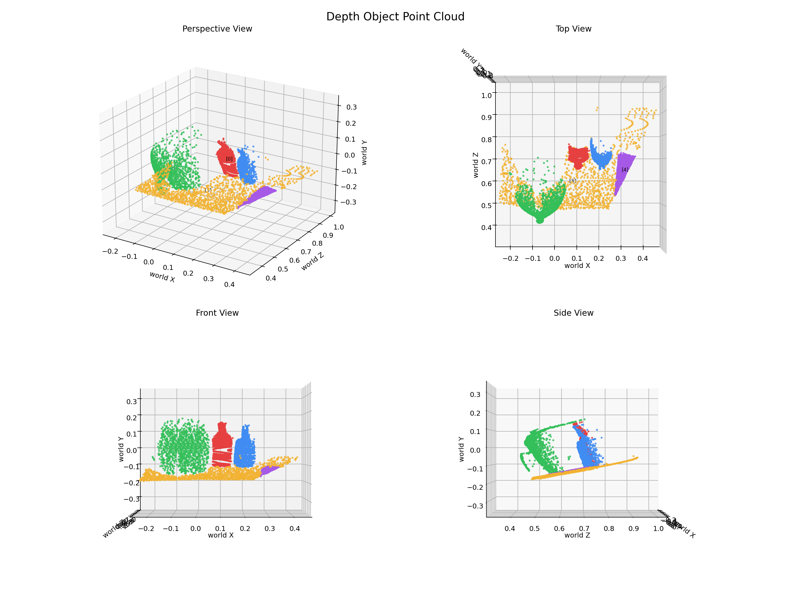

#### Camera calibration

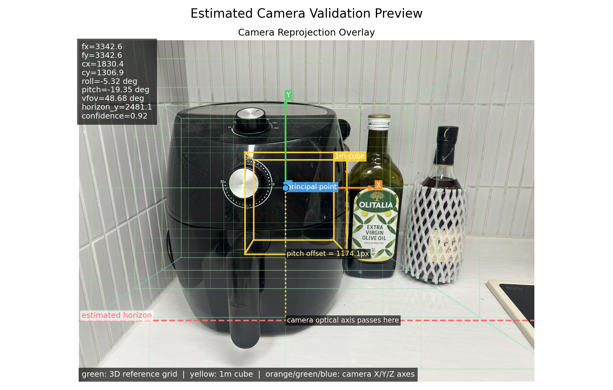


#### Layout preview

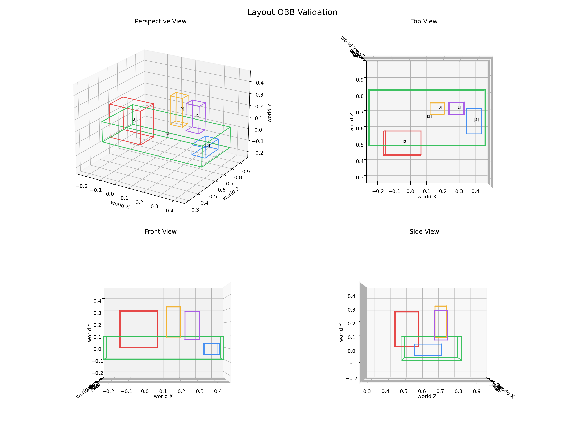

#### Output

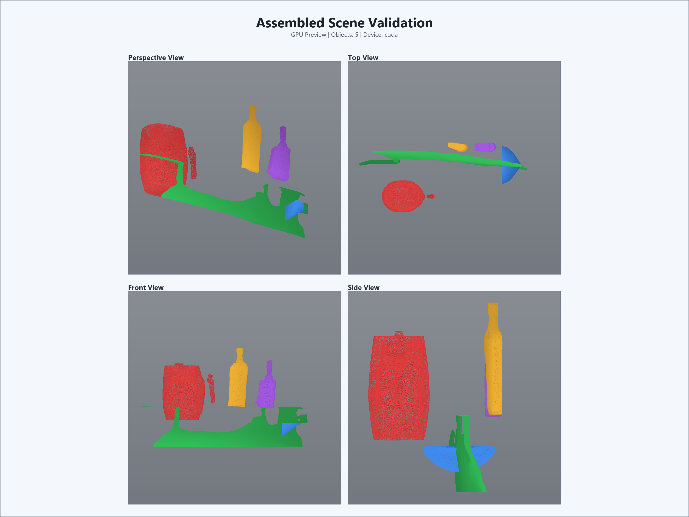


### Notes

- depth map 만으로 객체의 바운딩 박스를 계산하면 안된다는 것을 확인할 수 있다.
- Camera calibration Pointcloud 는 월드 좌표계로 변환하여 시각화하는 것이 좋아보인다.
- 배경이 객체 마스크로 들어간 경우 제외하는 로직이 필요하다.

---

> `2026-03-27` : 전체 파이프라인 설계 및 각 단계별 기능 구현

#### Input image


이미지 출처: [pixabay simple room image](https://pixabay.com/ko/photos/%ec%9d%b8%ed%85%8c%eb%a6%ac%ec%96%b4-%eb%94%94%ec%9e%90%ec%9d%b8-%ed%98%84%eb%8c%80%ec%a0%81%ec%9d%b8-%ec%8a%a4%ed%83%80%ec%9d%bc-4467768/)

#### Object mask / segmentation overlay


#### Depth estimation preview


#### Layout preview


#### Scene assembly previews


### Notes

- 배경과 붙어있는 객체는 잘 분리되지 않았다.
- 작거나 경계가 애매한 객체도 잘 분리되지 않았다.
- 객체들의 배치가 원본 이미지와 차이가 크다.
- depth estimation 결과를 3D 점으로 시각화하여 확인하면 좋을 것 같다.
- layout 시각화에 크기와 회전에 대한 시각화를 추가하는게 좋을 것 같다.

## 기술 스택

### Core

- Python
- PyTorch
- NumPy
- Pillow
- OpenCV
- Transformers
- Diffusers
- Matplotlib

### Vision / Segmentation

- RAM++
- Grounding DINO
- SAM2

### Generative Modeling

- Stable Diffusion XL Inpainting
- Shap-E

### Depth / Camera / Geometry / Scene Assembly

- DepthPro (`apple/DepthPro-hf`) 기반 absolute depth
- Perspective Fields 기반 camera parameter estimation
- camera + depth 기반 pseudo-world object placement
- OBJ / MTL assembly pipeline

### Project Structure

- modular stage pipeline
- dataclass-based config and schema organization
- artifact manifest and cache tracking
- stage별 preview/diagnostic visualization outputs
- unittest-based lightweight validation

## 참고 자료

- [Zero-Shot Scene Reconstruction from Single Images with Deep Prior Assembly](https://arxiv.org/html/2410.15971v1)
- [Diorama: Unleashing Zero-shot Single-view 3D Indoor Scene Modeling](https://arxiv.org/html/2411.19492v2)
- [3D-RE-GEN: 3D Reconstruction of Indoor Scenes with a Generative Framework](https://arxiv.org/html/2512.17459v1)
- [DepR: Depth Guided Single-view Scene Reconstruction with Instance-level Diffusion](https://arxiv.org/html/2507.22825v1)
- [InstaScene: Towards Complete 3D Instance Decomposition and Reconstruction from Cluttered Scenes](https://arxiv.org/html/2507.08416v2)
- [PixARMesh: Autoregressive Mesh-Native Single-View Scene Reconstruction](https://arxiv.org/html/2603.05888v1)
- [Gen3DSR: Generalizable 3D Scene Reconstruction via Divide and Conquer from a Single View](https://arxiv.org/html/2404.03421v2)
- [Open-World Amodal Appearance Completion](https://arxiv.org/html/2411.13019v1)
