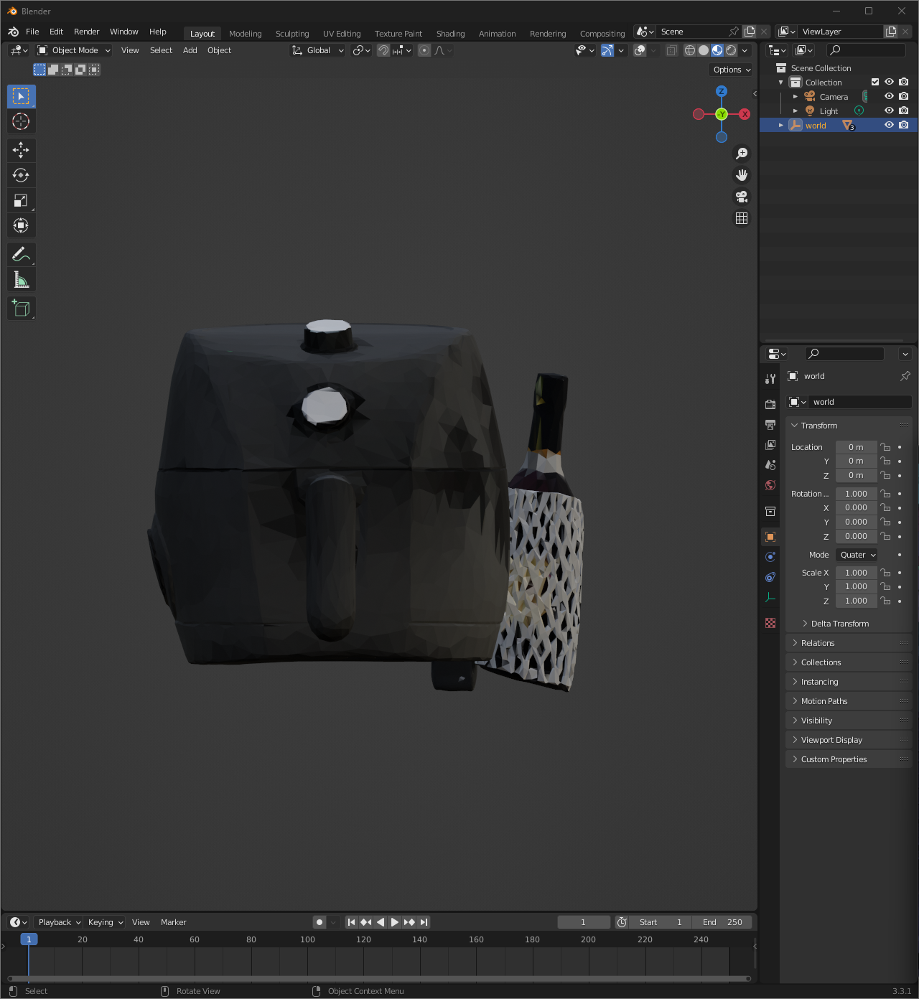
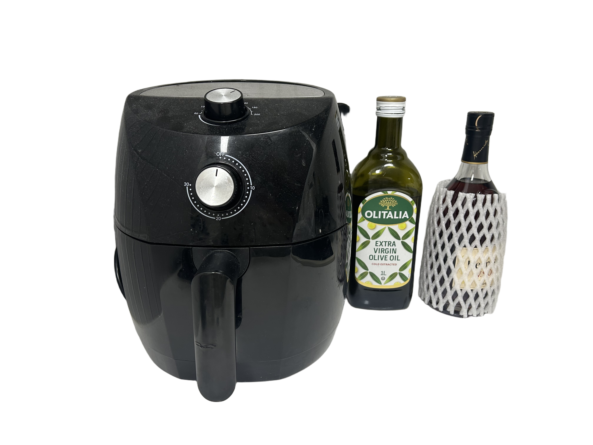
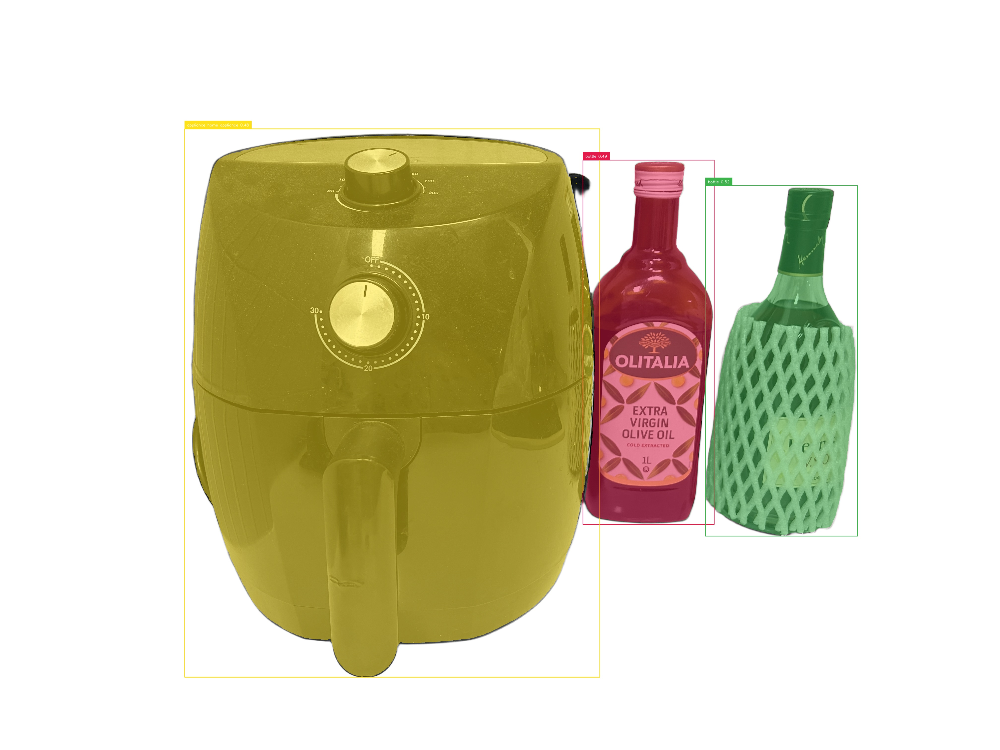
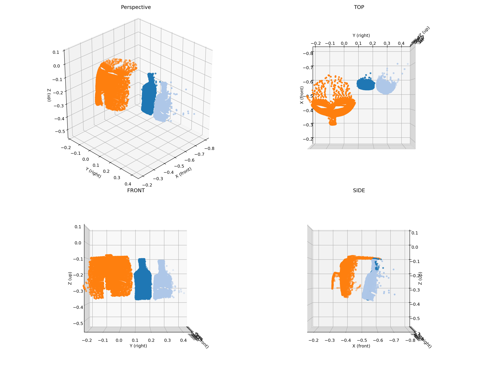
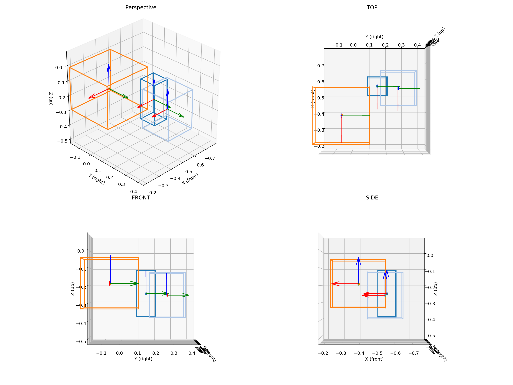
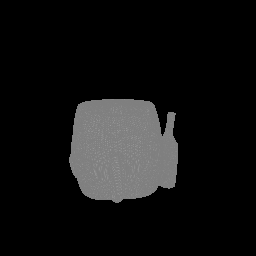

# Image-to-World

## 프로젝트 개요

## 결과물

### 입력 이미지


### 출력 GLB 스크린샷



## 파이프라인

### SEGMENTATION

#### 이미지 배경 제거



`BiRefNet` 모델을 이용하여 배경을 제거한다.

#### 객체 태그 추출

```
--------------
pretrained/ram_plus_swin_large_14m.pth
--------------
load checkpoint from pretrained/ram_plus_swin_large_14m.pth
vit: swin_l
Image Tags:  alcohol | appliance | beverage | black | blender | bottle | coffee machine | liquor | wine | home appliance | kitchenware | lid | liquid | mixer | olive | olive oil | wine bottle
图像标签:  酒精  | 设备  | 饮料  | 黑色 | 搅拌机  | 瓶  | 咖啡机 | 酒 | 葡萄酒 | 家用电器 | 厨房用具 | 盖子  | 液体  | 搅拌机 | 橄榄  | 橄榄油  | 酒瓶 
```

배경 제거된 이미지에서 `recognize-anything` 모델을 통해 태그를 추출한다.

#### 객체별 마스크 추출



`Grounded-SAM-2` 모델에 추출한 태그를 입력하여 객체별 마스크를 얻는다.

---

### GENERATION

#### 객체별 3D mesh 생성

.png)

객체 마스크별로 이미지를 크롭하여 `Hunyuan3D-2`에 입력으로 넣어 객체별 3D mesh 를 생성한다.

#### remesh

.png)  

생성된 mesh의 폴리곤을 줄인다.

---

### PLACEMENT

#### depth 추정


`ml-depth-pro` 모델을 이용해 이미지의 depth map을 얻는다.

#### 카메라 파라미터 및 자세 추정 기반 pointcloud



#### 초기 배치


마스크와 depth 정보를 결합해 객체의 초기 위치/크기/회전을 추정한다.

#### differential rendering



렌더링 결과와 원본 이미지의 차이를 최소화하도록 객체 transform을 반복 최적화한다.

## 결과물

[`2026-04-24` : 3D 메쉬 생성 모델 변경](./doc/260424/260424.md)

[`2026-04-10` : 객체 배치 정확도 개선](./doc/260409/260409.md)

[`2026-03-27` : 전체 파이프라인 설계 및 각 단계별 기능 구현](./doc/260327/260327.md)


## 기술 스택

## 개발 환경

- 언어: Python 3.11
- 실행 환경: 
- 외부 의존 리포지토리: 
- 필수 가중치/체크포인트:

## 실행 방법

```bash
python run.py
```

## 참고 자료

- [Zero-Shot Scene Reconstruction from Single Images with Deep Prior Assembly](https://arxiv.org/html/2410.15971v1)
- [Diorama: Unleashing Zero-shot Single-view 3D Indoor Scene Modeling](https://arxiv.org/html/2411.19492v2)
- [3D-RE-GEN: 3D Reconstruction of Indoor Scenes with a Generative Framework](https://arxiv.org/html/2512.17459v1)
- [DepR: Depth Guided Single-view Scene Reconstruction with Instance-level Diffusion](https://arxiv.org/html/2507.22825v1)
- [InstaScene: Towards Complete 3D Instance Decomposition and Reconstruction from Cluttered Scenes](https://arxiv.org/html/2507.08416v2)
- [PixARMesh: Autoregressive Mesh-Native Single-View Scene Reconstruction](https://arxiv.org/html/2603.05888v1)
- [Gen3DSR: Generalizable 3D Scene Reconstruction via Divide and Conquer from a Single View](https://arxiv.org/html/2404.03421v2)
- [Open-World Amodal Appearance Completion](https://arxiv.org/html/2411.13019v1)
- [TEASER: Fast and Certifiable Point Cloud Registration](https://arxiv.org/abs/2001.07715)

## 리소스 출처