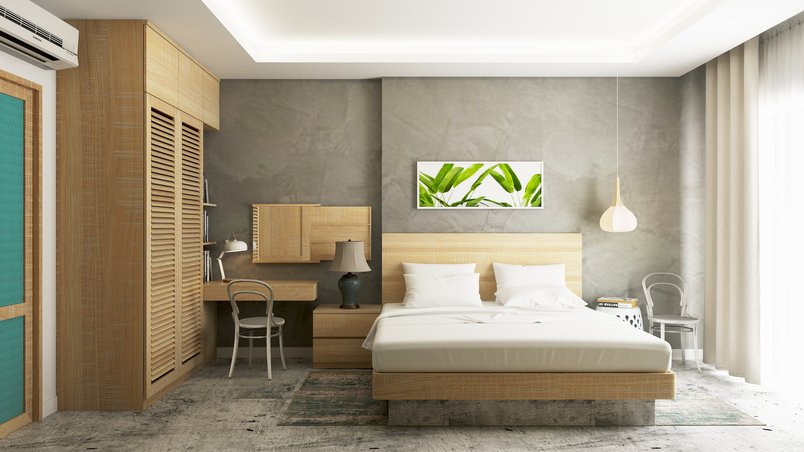
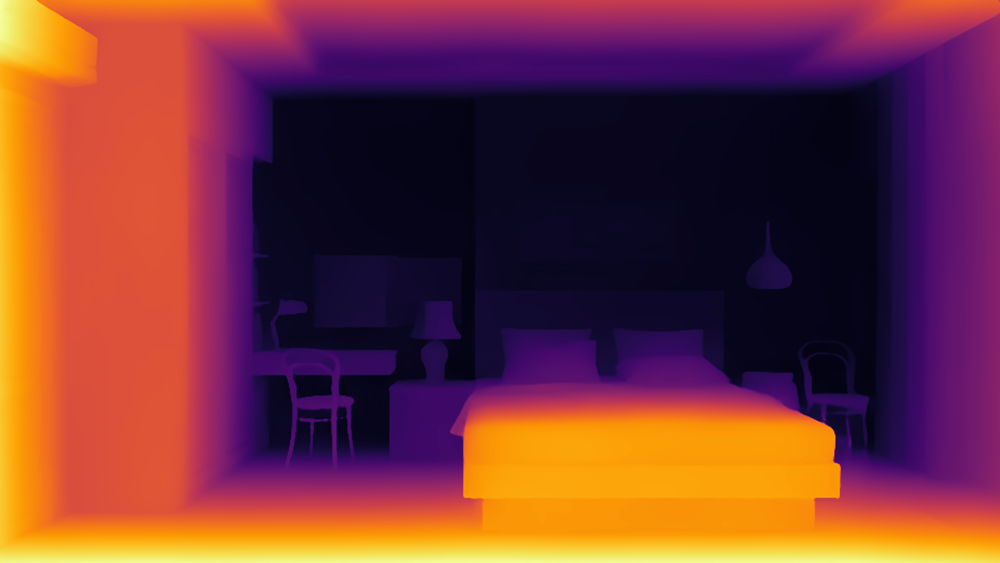
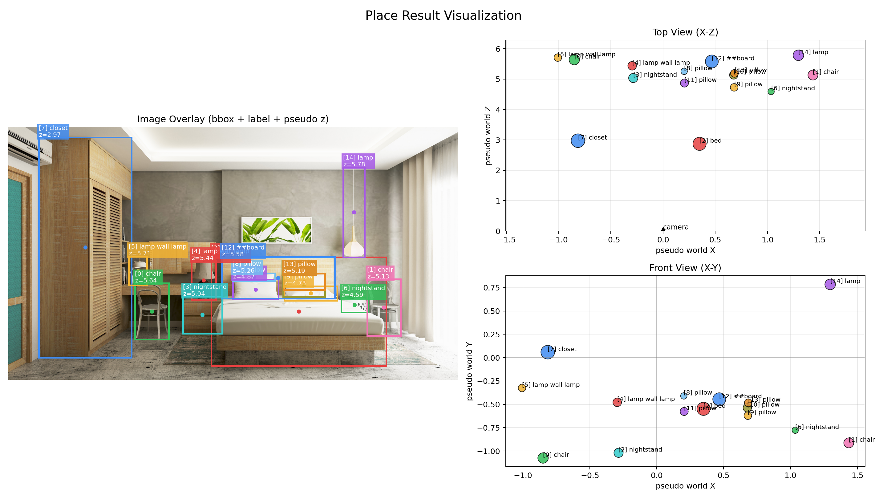
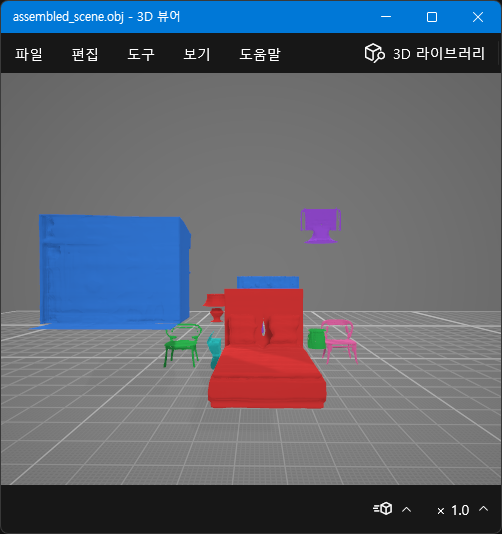
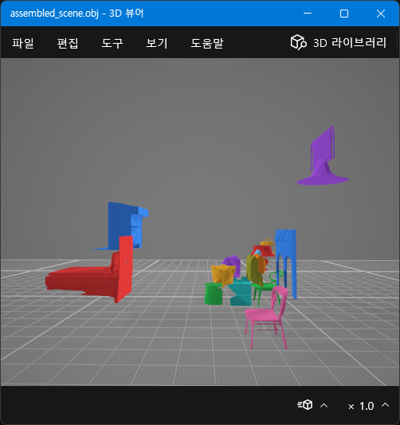
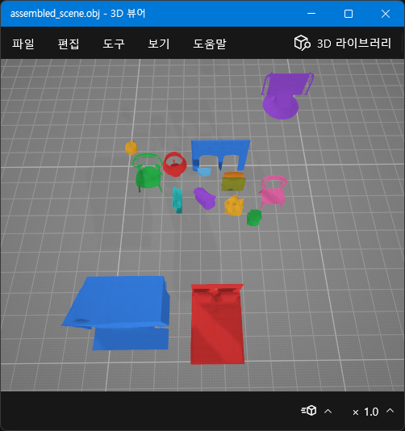

## 260327 구현 기록 (기준: `91f4aab77a48dbd43b480d314a5ba55dec71603f`)

#### Input

이미지 출처: [pixabay simple room image](https://pixabay.com/ko/photos/%ec%9d%b8%ed%85%8c%eb%a6%ac%ec%96%b4-%eb%94%94%ec%9e%90%ec%9d%b8-%ed%98%84%eb%8c%80%ec%a0%81%ec%9d%b8-%ec%8a%a4%ed%83%80%ec%9d%bc-4467768/)

#### Object segmentation

“이 장면에 뭐가 있는지(tag)”와 “어디에 있는지(bbox)”를 먼저 잡고, 마지막에 “정확히 어떤 픽셀인지(mask)”를 확정한다.

- `RAM++`: 이미지 전체를 보고 객체 후보 태그를 생성한다.
- `GroundingDINO`: 태그를 텍스트 조건으로 받아 객체 bbox를 찾는다.
- `SAM2`: bbox를 프롬프트로 받아 픽셀 단위 객체 마스크를 만든다.

#### Depth estimation

- `Depth Anything V2` 모델을 이용해 이미지에서 픽셀별 relative depth를 예측한다.

#### Layout

$$
\begin{bmatrix}
x\\y\\f
\end{bmatrix}
=
\frac{f}{Z}
\begin{bmatrix}
X\\Y\\Z
\end{bmatrix}
$$

`핀홀 카메라 모델` 의 기본 수식을 이용하여 3D 좌표로 변환한다.

$ X = \frac{(u−c_x)}{f_x}\,Z\qquad Y = \frac{(v−c_y)}{f_y}\,Z\qquad Z = Z_{pseudo} $
- $u, v$: bbox 중심 픽셀 좌표
- $c_x, c_y$: 이미지 중심 픽셀 좌표
- $f_x, f_y$: 임의 가정 focal
- $Z_{pseudo}$: depth 중앙값 (전체 depth map의 최대/최소를 이용해 정규화)

같은 방식으로 bbox 크기를 이용해 각 객체의 width와 height를 구한 뒤

$ scale = \sqrt{width \cdot height} $

위 값을 크기로 저장한다. 

#### Output

- `SDXL Inpainting`: 보이는 객체 crop을 바탕으로 가려진 부분까지 포함한 amodal 외형을 보완한다.
- `Shap-E`: 객체 이미지에서 단일 객체 3D mesh를 생성한다.

각 mesh를 중심 정렬 + 최대 길이 기준 정규화한 unit box로 변환한다.

$ v' = \frac{v - c}{\max(\Delta_x,\Delta_y,\Delta_z)} $
- $c$: mesh bbox 중심
- $ \Delta_x,\Delta_y,\Delta_z $: bbox 축별 길이

객체별 위치/크기 변환을 적용해 하나의 OBJ/MTL로 병합한다.

### Notes

- 배경과 붙어있는 객체는 잘 분리되지 않았다.
- 작거나 경계가 애매한 객체도 잘 분리되지 않았다.
- 객체들의 배치가 원본 이미지와 차이가 크다.
- depth estimation 결과를 3D 점으로 시각화하여 확인하면 좋을 것 같다.
- layout 시각화에 크기와 회전에 대한 시각화를 추가하는게 좋을 것 같다.