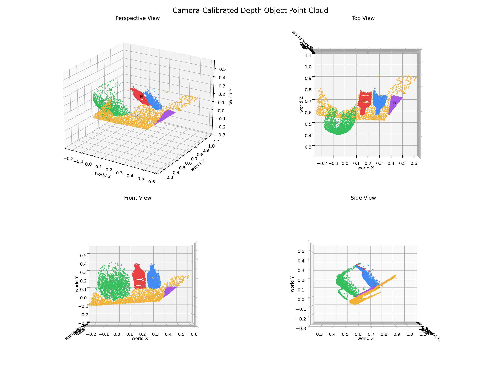
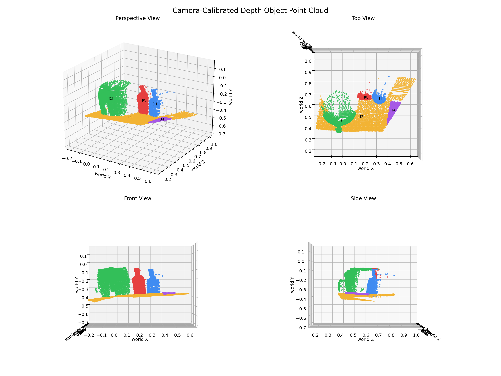
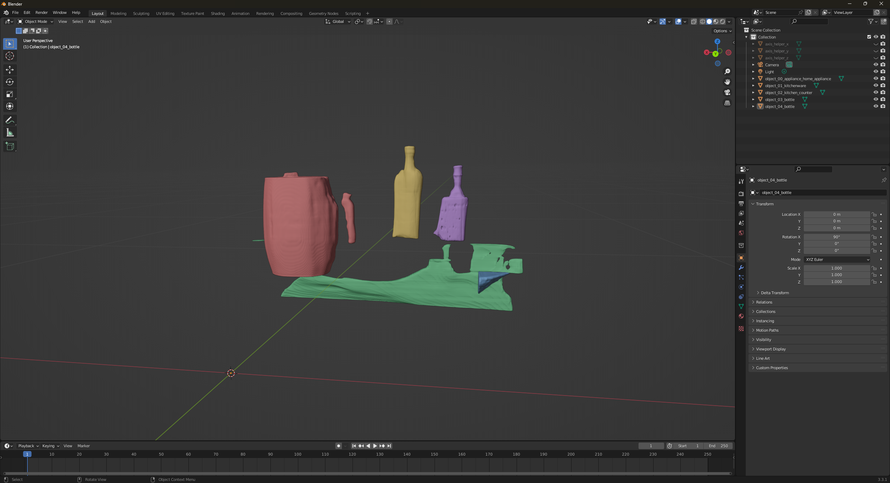
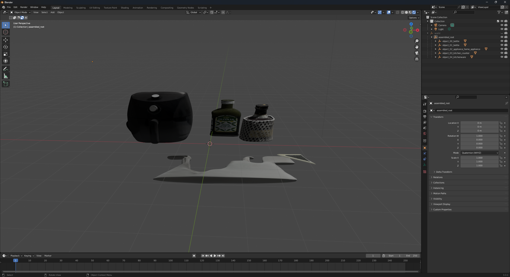

### DONE

- pointcloud 좌표 보정: depth back-projection 후 카메라 Euler 역회전(inverse pitch/roll/yaw) 적용으로 월드 정렬 XYZ 포인트클라우드 생성
- 3D 메쉬 생성 모델 변경: ShapE → Hunyuan3D-2
- 객체 배치 로직 변경 (진행중): depth 기반 cube 위치 추정 → mesh-depth 정합 (Depth reprojection + Ray-mesh intersection + RANSAC 선형회귀 기반 z-scale 보정)

### TODO

- 객체 배치 로직 개선
- inpainting 단계 inpaint 영역 계산 정밀화
- 생성된 3D 메쉬 remesh
- 배경/구조물 복원
- 발표 준비
- 코드 리팩토링 및 README 내부 문서 정리

### RESULT

#### pointcloud before

#### pointcloud after

#### output before

#### output after

