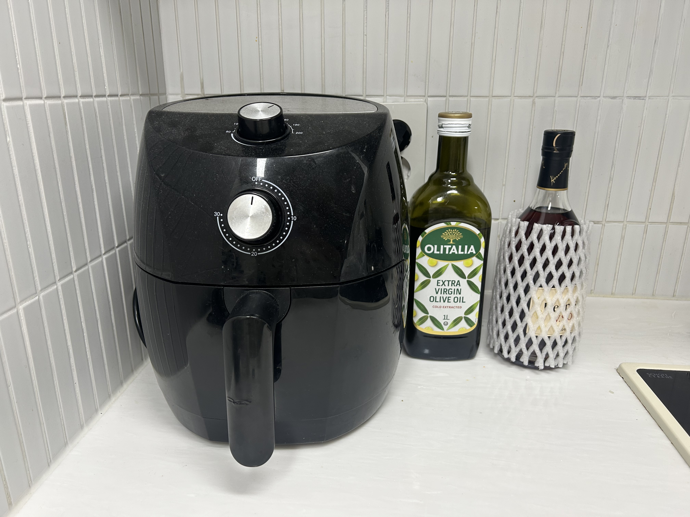
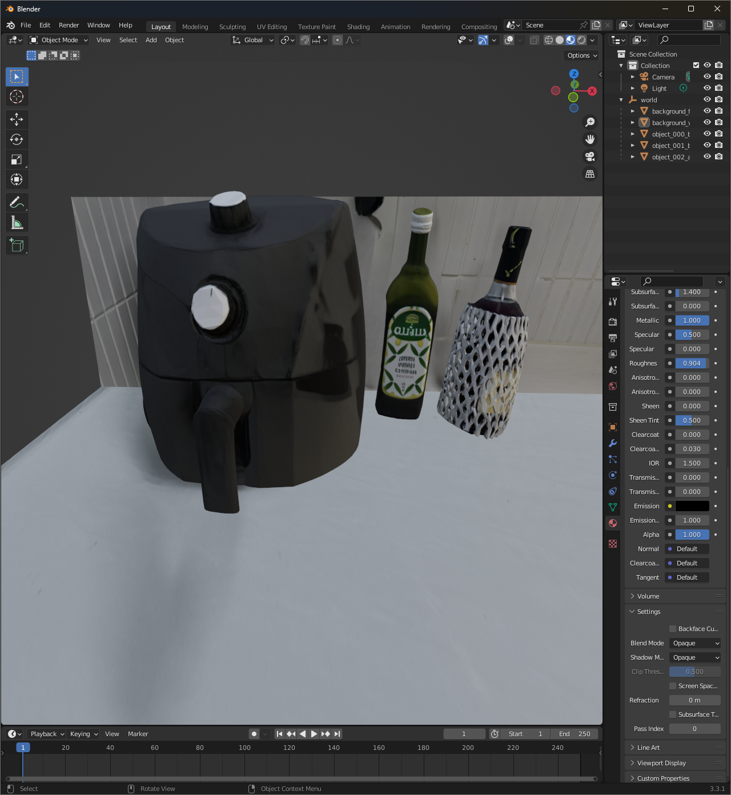
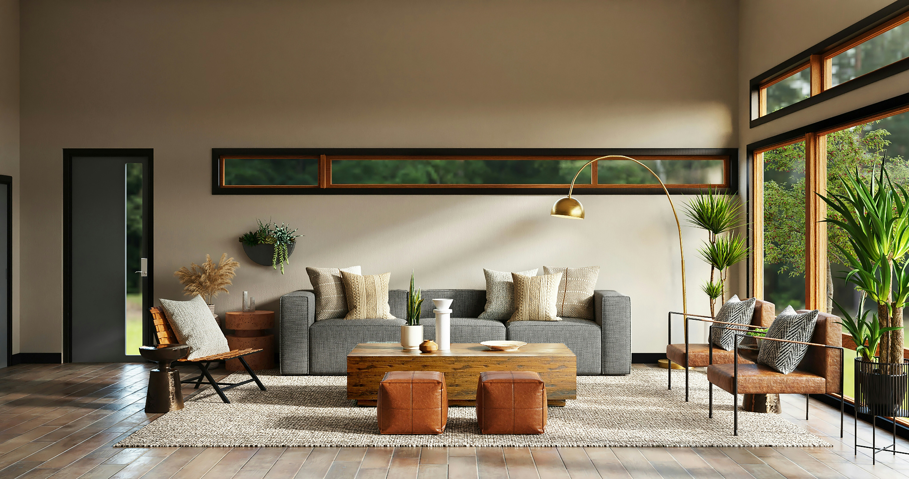
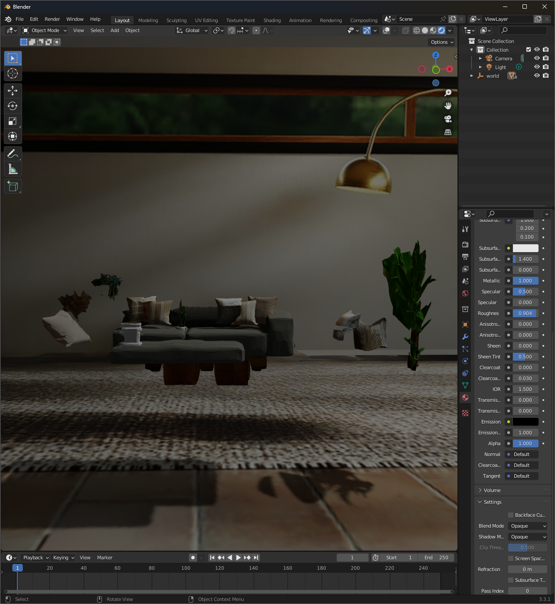

## 260529 진행 기록

### 비교 이미지

#### 케이스 A 입력 이미지

#### 기존 결과물 (이전 버전)

#### 케이스 A 현재 결과물

#### 케이스 B 입력 이미지

#### 케이스 B 현재 결과물

### 변경 사항
1) 배경 복원: `LaMa` inpainting으로 movable object 영역을 제거해 clean background 생성 및 씬 배경 텍스처로 사용.
2) 객체 배치 개선: `Differential Rendering` 기반으로 객체 transform(translation/scale/rotation) 최적화.
  - 입력 이미지와 렌더링 결과의 reprojection 오차를 줄이는 방향으로 반복 업데이트.
  - `PerspectiveFields` 카메라 추정값(vfov/pitch/roll)을 초기 조건으로 사용해 정합 안정화.

### 남은 할일
- 1) `Differential Rendering` 최적화 안정화
- 2) 배경/구조 복원 고도화
- 3) 배치 물리 제약 추가
- 4) 평가 체계 강화
